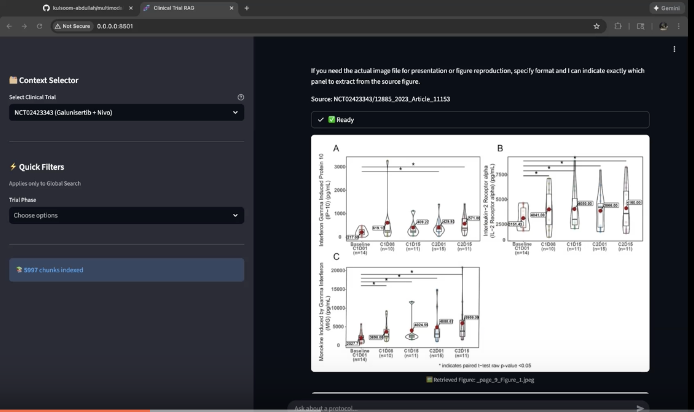

# Agentic Multimodal Clinical Trial RAG

  

[](https://www.loom.com/share/fa53f00157fc407aafc4dd02c4d7f1ee)
> *Click the image above to watch the 4-minute demo video.*

**Current Status:** 🔬 **Phase 3: Advanced Architecture (Metadata-Driven Agent)**

This is an end-to-end **agentic RAG system** designed to answer complex questions about clinical trial protocols with high precision. Unlike standard RAG demos, this project solves the specific challenges of **"Filter-then-Search"** workflows in the medical domain by combining structured metadata extraction with semantic retrieval.

---

## 💡 Why RAG? (The Business Case)

Why build a complex RAG system instead of fine-tuning a model or using a long-context window?

1.  **Data Velocity:** Clinical trials change constantly. A pre-trained model is frozen in time. RAG allows us to ingest a new protocol PDF today and query it immediately without expensive re-training.
2.  **Hallucinations vs. Grounding:** In the medical domain, "guessing" is unacceptable. This system forces the LLM to answer *only* based on retrieved evidence, providing strict citations (e.g., `[Source: Prot_000/SAP]`) for auditability.
3.  **The "Needle in the Haystack":** Clinical protocols are dense, 200+ page documents. Simple vector search often retrieves irrelevant sections. By using an **Agentic Router**, we distinguish between looking up a specific ID (Keyword Search) and understanding a mechanism (Semantic Search).

---

## 🏗️ System Architecture

The system employs a **Two-Stage Retrieval Pipeline** (Funnel Approach) to balance recall and precision, coupled with a **Decoupled Multimodal Strategy** to handle complex clinical figures.

```mermaid
graph LR
    subgraph Ingestion
    A[PDF Input] --> B(Marker Extraction)
    B --> C{Data Router}
    C -->|Images| D["GPT-4o-mini<br/>Vision Captioning"]
    C -->|Text| E[Chunking]
    D --> F["ChromaDB<br/>Vector Store"]
    E --> F
    end

    subgraph Retrieval_Pipeline
    Q[User Query] --> R{Router Agent}
    R -->|ID Query| S[Strict Metadata Filter]
    R -->|Concept Query| T["Hybrid Search<br/>(BM25 + Vector)"]
    S --> U[15 Candidate Docs]
    T --> U
    U --> V["Cross-Encoder<br/>Re-Ranking"]
    end

    subgraph Generation
    V --> W[Top 5 Context]
    W --> X[GPT-4o-mini Response]
    W --> Y[UI Image Renderer]
    end
````

### 🧠 Multimodal Strategy: The "Caption Proxy" Approach

To balance retrieval speed with visual understanding, this system uses a decoupled approach:

1.  **Ingestion:** Images are isolated during PDF parsing. `GPT-4o-mini` (Vision) analyzes the image and generates a dense, descriptive text summary (the "Caption Proxy").
2.  **Indexing:** This text summary is embedded and indexed in ChromaDB, linking back to the original image path.
3.  **Retrieval:** The system searches for *concepts* (e.g., "tumor reduction graph"). It retrieves the *caption*, allowing the LLM to "read" the chart data from the summary.
4.  **Rendering:** The Streamlit UI uses the metadata path to display the actual pixel-perfect image to the user alongside the answer.

**Why not CLIP embeddings?**
Clinical figures contain dense numerical information (survival curves, genomic heatmaps) that general vision encoders like CLIP often miss. CLIP excels at object detection ("dog vs cat") but struggles with "median OS 19.6 months with 95% CI". By using GPT-4o-mini to generate detailed text descriptions, we preserve the numerical precision needed for clinical queries while maintaining semantic searchability.

### 📊 Performance Metrics (Latency Breakdown)

Latency is optimized by using a two-stage funnel, performing expensive re-ranking only on a small candidate set.

| Component | Latency | Technology |
| :--- | :--- | :--- |
| **Retrieval Stage** | \~200ms | ChromaDB Vector Search + BM25 (Hybrid) |
| **Re-ranking Stage** | \~150ms | Cross-Encoder (MS-MARCO) on top 15 candidates |
| **Generation** | \~800ms | LLM Inference (GPT-4o-mini) |
| **Total E2E** | **\~1.2s** | (Excluding model cold-start) |

-----

## 🛠️ Tech Stack

  - **Extraction**: `marker-pdf` (GPU-accelerated layout analysis & OCR)
  - **Orchestration**: LangChain (Custom Dynamic Router & Multimodal Chains)
  - **Metadata Agent**: `Claude Sonnet 4.5` (Chosen for superior reasoning on protocol headers)
  - **Vision Agent**: `GPT-4o-mini` (Benchmarked as best cost/performance for chart analysis)
  - **Embeddings**: `NeuML/pubmedbert-base-embeddings` (Biomedical domain-specific)
  - **Vector Store**: `ChromaDB` (Persistent local storage with metadata filtering)
  - **Reranking**: `cross-encoder/ms-marco-MiniLM-L-6-v2`
  - **Environment**: Python 3.11 | Docker

-----

## 🔬 Engineering Decisions: The Vision Model Benchmark

Handling redacted clinical images required a specialized Vision model. We benchmarked 9 leading models to find the optimal balance of cost, speed, and safety compliance.

**The Challenge:** The pipeline needed to extract data from complex figures like this Genomic Heatmap:

*(Figure 1 from Trial NCT02423343)*

### Benchmark Results

We wrote a custom benchmarking script ([`scripts/benchmark_vision.py`](https://www.google.com/search?q=scripts/benchmark_vision.py)) to test latency and quality against this "Golden Sample."

| Model | Latency | Cost (Est.)\* | Quality (Chars) | Status |
| :--- | :--- | :--- | :--- | :--- |
| **GPT-5.1** | 12.07s | $0.00130 | 0 | ❌ **FAILED** (Safety Refusal) |
| **GPT-5-mini** | 20.50s | $0.00125 | 0 | ❌ **FAILED** (Safety Refusal) |
| **GPT-4.1-mini** | 7.96s | $0.00240 | 2,070 | ✅ Good |
| **GPT-4o-mini** | **9.45s** | **$0.00045\*\* | **1,809** | ✅ **WINNER** (Best Value) |
| **Claude Haiku 4.5** | 7.68s | $0.00350 | 1,596 | ✅ Good |
| **Claude Haiku 3.5** | 6.81s | ~$0.00025 | 1,110 | ✅ Good (Fastest) |
| **Claude 3.7 Sonnet**| 7.70s | $0.01050 | 1,168 | ✅ Good |
| **Claude 4.5 Sonnet**| 17.13s | $0.01050 | 1,934 | ✅ Excellent Detail |

*\*Cost estimated per single image transaction.*

### Key Findings

1.  **The "Safety Gap":** Both `gpt-5.1` and `gpt-5-mini` consistently refused to analyze the clinical heatmap, returning empty responses due to strict safety filters regarding medical data.
2.  **Cost Efficiency:** `gpt-4o-mini` was the clear winner for production scaling. It captured 85%+ of the relevant clinical details (PFS, OS, Genetic Mutations) while being **23x cheaper** than the high-end Claude Sonnet models.
3.  **Decision:** I selected `gpt-4o-mini` for the production pipeline. This enables the processing of 120+ trial images for approximately **$0.05** total, ensuring the system remains cost-effective without sacrificing retrieval accuracy.

-----

## 📊 Performance Benchmarks

I built a custom evaluation pipeline (`scripts/evaluate_retrieval.py`) to benchmark the system against a "Golden Dataset" of tricky clinical queries.

| Query Type | Challenge | Logic Used | Recall@3 | Latency |
| :--- | :--- | :--- | :--- | :--- |
| **ID Lookup** | *"Objective of 3000-02-005"* | **Strict Mode** (Hard Filter) | **100%** | 1.08s |
| **Concept** | *"Side effects of PARP..."* | **Hybrid** (Semantic + BM25) | **100%** | 1.01s |
| **Filtering** | *"Phase 3 trials for NSCLC"* | **Metadata Filter** | **100%** | 0.85s |

## 📝 Example Queries

**Multimodal Retrieval:**

```
Q: "Show me the violin plot for IP-10"
A: [Retrieves and displays actual clinical figure with detailed caption]
```

**Strict ID Lookup:**

```
Q: "What is the primary objective of study 3000-02-005?"
A: To evaluate the efficacy of dostarlimab, bevacizumab, and 
   niraparib in advanced relapsed ovarian cancer...
   [Source: NCT05751629/SAP_001]
```

-----

## 🔮 Limitations & Future Work

### Current Limitations

  * **Extraction Consistencies:**
      * **Phase Extraction:** Metadata extraction currently struggles with inconsistent formatting in source PDFs (e.g., "Phase 2" vs "Phase II" vs "Phase 1b/2"), leading to occasional filtering gaps.
      * **Complex Redactions:** While the vision agent salvages most data, heavy redactions in some legacy PDFs can still result in partial data loss.
  * **Retrieval Bias:**
      * **Semantic Density:** For broad conceptual queries (e.g., "Side effects"), the retriever may bias toward documents with the densest coverage of the topic rather than aggregating equally across all trials.
      * **Cold Start:** The initial model loading on serverless GPU instances creates a \~8-10s latency on the very first query.
  * **Scope of Data:**
      * **Protocols vs. Results:** The system correctly identifies that Clinical Protocols contain study *designs*, not study *results*. Queries asking for "results" (e.g., "What were the adverse events?") are correctly answered as "Not available in provided text" rather than hallucinated.

### Roadmap

  * [ ] **Robust Phase Detection:** Implement a multi-pass extraction agent using Regex + LLM validation to normalize Trial Phases into a standard enum.
  * [ ] **Compound Filtering:** Enable the UI to support "AND/OR" logic for filtering by both Trial ID AND Phase simultaneously.
  * [ ] **Metadata Confidence Scores:** Add a confidence score (0.0 - 1.0) to extracted metadata fields to flag low-confidence tags for human review.
  * [ ] **Streaming Responses:** Implement token streaming to reduce perceived latency for long answers.

-----

## 📂 Repository Structure

```bash
├── app_v2.py                     # Streamlit UI with Router Visualization
├── Dockerfile                    # Production-ready container config
├── scripts/
│   ├── ingest_data_advanced.py   # The "Brain": Metadata extraction & Indexing
│   ├── query_rag.py              # The "Logic": Dynamic Router & RAG Chain
│   ├── fix_image_descriptions.py # The "Repair Agent": Vision-based metadata augmentation
│   ├── benchmark_vision.py       # The "Lab": Model comparison script
│   └── evaluate_retrieval.py     # The "Proof": Calculating Recall@K
├── data/                         # (Ignored) ChromaDB & Docstore
└── requirements.txt              # Dependencies
```

-----

## 🚀 How to Run

### Prerequisites

Create a `.env` file with:

```
OPENAI_API_KEY=sk-...
ANTHROPIC_API_KEY=sk-...
```

### Option A: Docker (Recommended)

The easiest way to run the full system with all dependencies.

```bash
# 1. Build the image
docker build -t clinical-rag .

# 2. Run the container (Exposes port 8501)
docker run --env-file .env -p 8501:8501 clinical-rag
```

*Navigate to `http://localhost:8501`*

### Option B: Local Development

```bash
# 1. Create environment
conda create -n clinical-rag python=3.11 -y 
conda activate clinical-rag

# 2. Install dependencies
pip install -r requirements.txt

# 3. Run the App
streamlit run app_v2.py
```

````
