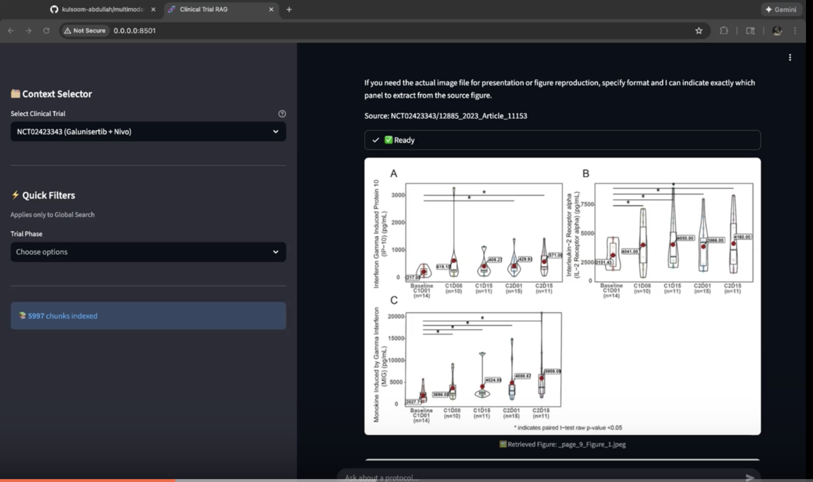
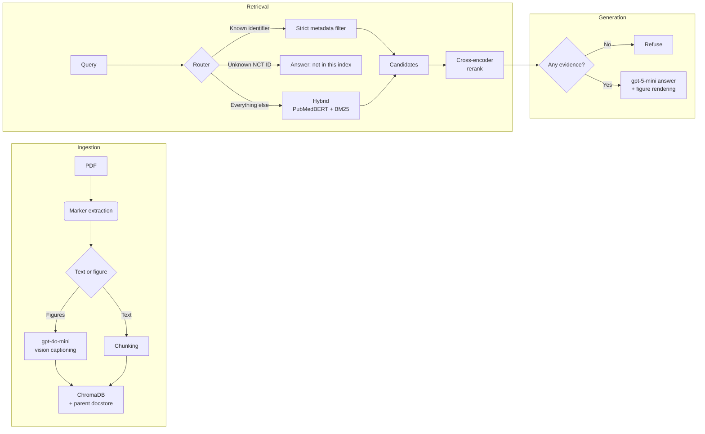

# Multimodal Clinical Trial RAG

  

A retrieval system over clinical trial protocols and statistical analysis plans. It answers
questions about study design, dosing, endpoints and eligibility from the documents themselves,
renders the figures it retrieves, and refuses when it finds no evidence rather than answering from
model priors.

Built on 13 documents — 6 studies, 7 registrations, 5,902 indexed chunks, 130 figures.

[](https://www.loom.com/share/fa53f00157fc407aafc4dd02c4d7f1ee)
> 4-minute walkthrough. Recorded against an earlier build of the interface.

---

## Measured results

Every number below is reproducible from a committed artifact in [`data/eval_runs/`](data/eval_runs/).

**Retrieval — [`eval_2026-08-04.json`](data/eval_runs/eval_2026-08-04.json)**

| Metric | Value |
| :--- | :--- |
| Recall@3 by `trial_id` | 4/4 = 100% |
| Recall@3 by `protocol_number` | 4/4 = 100% |
| Random floor for the same metric on this corpus | 27.8% |
| Mean latency, retrieval + rerank | 0.64s |

`n = 4`. That is a small set and the number should be read as a smoke test, not a benchmark. The
floor is what three uniformly random chunks would score, so 100% is roughly 3.6× chance rather than
infinitely better than nothing. Gold labels and the reasons behind each one are registered in
[`GOLD_PREREGISTRATION.md`](data/eval_runs/GOLD_PREREGISTRATION.md), which also records the eval's
known weaknesses — including that one of the four queries cannot fail by construction.

Latency excludes answer generation, which is an LLM call whose duration depends on the model and
the answer length. There is no committed end-to-end measurement.

Run it yourself:

```bash
python scripts/evaluate_retrieval.py --json out.json --min-recall 1.0
```

It exits non-zero below the recall floor, so a regression fails rather than printing a lower number.

---

## How retrieval works


```mermaid
graph LR
    subgraph Ingestion
    A[PDF] --> B(Marker extraction)
    B --> C{Text or figure}
    C -->|Figures| D["gpt-4o-mini<br/>vision captioning"]
    C -->|Text| E[Chunking]
    D --> F["ChromaDB<br/>+ parent docstore"]
    E --> F
    end

    subgraph Retrieval
    Q[Query] --> R{Router}
    R -->|Known identifier| S[Strict metadata filter]
    R -->|Unknown NCT ID| Z[Answer: not in this index]
    R -->|Everything else| T["Hybrid<br/>PubMedBERT + BM25"]
    S --> U[Candidates]
    T --> U
    U --> V["Cross-encoder<br/>rerank"]
    end

    subgraph Generation
    V --> W{Any evidence?}
    W -->|No| X[Refuse]
    W -->|Yes| Y["gpt-5-mini answer<br/>+ figure rendering"]
    end
```

**The router resolves identifiers against the index rather than matching them by pattern.**
Protocol numbers here take too many shapes for a regex — `205801`, `CA116001`, `189`,
`KEYNOTE-189`, `3000-02-005` — and any pattern loose enough to cover them also matches ordinary
hyphenated clinical English like `non-small-cell` or `intent-to-treat`, which would send an
ordinary question into a metadata filter that matches nothing. Candidates are checked against the
identifiers actually present in the index: recognised ones route to a strict filter, unrecognised
ones fall through to hybrid search, and an NCT ID that is well-formed but absent is answered as
absent instead of silently broadened. All indexed protocols are reachable by strict routing.

**Empty retrieval refuses.** If the router returns nothing, the pipeline says so rather than
prompting the model with an empty context — in a clinical setting a fluent answer from no evidence
is the worst available failure. Routing and the answer prompt live in
[`scripts/router.py`](scripts/router.py) so the CLI and the app cannot drift apart.

---

## Design note: NCT ID is not a primary key

The most useful thing this corpus taught me is that trial registration IDs do not identify
documents.

It contains a GSK master protocol (`205801`) for NSCLC whose sub-study arms are **separately
registered**. `NCT05553808` and `NCT06926673` are both valid registrations of documents belonging
to that one protocol, and a sub-study's statistical analysis plan can legitimately cite the master
record on its title page while carrying its own registration. Registrations are therefore
many-to-one against documents, and the directory a PDF happens to be filed under is not an
authority on what it is.

Identity is keyed on **protocol number plus amendment**. `trial_id` is retained, but only when the
extracted value is a real registration — `^NCT\d{8}$` — with the source directory as a validated
fallback. Every chunk records `trial_id_source`, so whether an identity was extracted from the
document or inherited from its folder is auditable rather than assumed.

This is not a theoretical concern. On the first scored rebuild, the query *"What is the primary
objective of study 3000-02-005?"* **missed under `trial_id` and hit under `protocol_number`, on
identical retrieval.** The metadata filter selected exactly the right 122 chunks; those chunks
carried a wrong registration because metadata extraction had returned a plausible-looking internal
study number instead of an NCT ID. Protocol-keyed identity was unaffected. Details in
[`rebuild_2026-08-04.md`](data/eval_runs/rebuild_2026-08-04.md).

---

## Figures

Clinical figures carry information that matters — survival curves, genomic heatmaps, dose-escalation
tables — and much of it is numeric. Rather than embedding images directly, a vision model writes a
dense description of each figure; that description is embedded and indexed, and the UI renders the
original image alongside the answer.

The reason for captioning rather than CLIP-style image embeddings is that these figures are dense
with numbers and axis labels. General vision encoders are good at "what is this a picture of" and
poor at "median OS 19.6 months, 95% CI 12.4–28.1", which is the part a clinical query needs to match.

130 figures are indexed, one vector each. 43 are classified as carrying no clinical information —
logos, headers, rules — and 47 describe redactions in the source documents while summarising what
remains visible.

---

## Vision model benchmark

Nine model IDs are configured in [`scripts/benchmark_vision.py`](scripts/benchmark_vision.py);
**6 were reachable and 5 returned output** on the run below. Every model captioned the same figure.

**Method: cost is computed from the token usage each call reports, not from an assumed token
count.** The published rate is what a provider charges per million tokens; the tokens consumed are
read off the response. Multiplying the two gives the cost of captioning one image.

Rows are ordered by published input price, cheapest first. Prices are USD per 1M tokens, OpenAI
verified 2026-08-04. Full run: [`vision_benchmark.json`](data/eval_runs/vision_benchmark.json).

| Model | List price in / out | Tokens in | Tokens out | **Cost for this image** | Output chars |
| :--- | ---: | ---: | ---: | ---: | ---: |
| gpt-4o-mini | $0.15 / $0.60 | 25,553 | 461 | $0.00411 | 2,172 |
| gpt-5-mini | $0.25 / $2.00 | 1,095 | 1,000 | $0.00027 | 0 |
| gpt-4.1-mini | $0.80 / $3.20 | 1,462 | 461 | $0.00264 | 1,999 |
| claude-haiku-4-5 | $1.00 / $5.00 | 1,181 | 611 | $0.00424 | 1,962 |
| gpt-5.1 | $1.25 / $10.00 | 681 | 1,000 | $0.01085 | 3,020 |
| claude-4-5-sonnet | $3.00 / $15.00 | 1,181 | 602 | $0.01257 | 1,995 |

Reading down the token column: `gpt-4o-mini` encodes this figure as 25,553 input tokens, while
`claude-4-5-sonnet` encodes the same file as 1,181 and `gpt-5.1` as 681. **Models tokenize images
differently — by more than an order of magnitude — so the per-token price does not predict what an
image costs.** `gpt-4o-mini` has the lowest listed input rate in the table and does not produce the
lowest per-image cost.

**`gpt-5-mini` returned zero characters while consuming its full 1,000-token output budget.** That
is reasoning-token exhaustion under the configured cap, not a content refusal — distinguishable only
because output tokens are recorded. Its cost is shown for input alone, since no output was billed.
`gpt-5.1`, given the same image and cap, produced the longest description of any model tested.

Quality here is output length only. **There is no accuracy rubric**, one image was tested, and
length is a weak proxy for whether a description is correct.

The shipped pipeline captions with `gpt-4o-mini`.

---

## Tech stack

- **PDF extraction** — [`marker-pdf`](https://github.com/VikParuchuri/marker), GPU layout analysis and OCR
- **Metadata extraction** — `claude-sonnet-4-5`, structured output against a Pydantic schema
- **Figure captioning** — `gpt-4o-mini` vision
- **Embeddings** — `NeuML/pubmedbert-base-embeddings`, biomedical domain
- **Vector store** — ChromaDB with a parent-document store for retrieval
- **Reranking** — `cross-encoder/ms-marco-MiniLM-L-6-v2`
- **Answer generation** — `gpt-5-mini`
- **Orchestration / UI** — LangChain, Streamlit, Docker

---

## Corpus and provenance

13 documents across 6 studies and 7 registrations: protocols, statistical analysis plans, and two
published papers reporting results of studies already in the corpus.

Source PDFs are **not redistributed** — they are gitignored, as are the built index, the docstore
and the extracted figures. All are regenerable from the scripts, given the source documents and API
keys.

`images/benchmark_heatmap.jpeg` is Figure 1 of *BMC Cancer* article
[12885_2023_11153](https://doi.org/10.1186/s12885-023-11153-1), reproduced under
[CC BY 4.0](https://creativecommons.org/licenses/by/4.0/). It is patient-level but de-identified.

---

## Limitations

What has not been validated, stated as plainly as what has:

- **The eval is n=4.** One query flipping moves the figure 25 points. One of the four is
  tautological: strict mode filters on a protocol ID and is then scored on the trial that filter
  necessarily selects. Another has a single gold trial although three trials in the corpus mention
  the drug class. Both are documented in the pre-registration.
- **No precision metric.** Recall@3 says a relevant chunk appeared; nothing measures how much of
  what was retrieved was irrelevant.
- **No accuracy rubric for figure captions.** The vision benchmark measures latency, real token
  cost and output length on **one** image. Nothing checks whether a description is factually right.
- **No answer-quality evaluation.** Retrieval is measured; the generated answers are not scored
  against references.
- **The corpus is small and lopsided.** The `205801` master protocol accounts for roughly half of
  all chunks, so aggregate retrieval behaviour is dominated by one study.
- **Phase metadata is inconsistent.** Extraction yields `Phase 2`, `Phase 1b/2`, `Phase 1/Phase 2`
  and `<UNKNOWN>` for what are sometimes the same design, so phase filtering is approximate.
- **Phase filtering is a post-filter on the keyword half.** BM25 does not honour metadata filters,
  so the phase selection is applied after merging — a phase-filtered query can return fewer than
  five chunks. Fewer correct chunks is preferred to more with out-of-phase leakage.
- **Three configured Anthropic model IDs now return 404**, so the vision benchmark is not fully
  reproducible as configured. The committed artifact records which models ran.
- **Metadata extraction is nondeterministic.** The same document can yield different `trial_id`
  values across runs; this is why the value is shape-validated and its provenance recorded rather
  than trusted.
- **Not deployed.** It runs locally and in Docker. There is no hosted instance.

---

## Repository

```
app_v2.py                         Streamlit UI, router visualisation, figure rendering
scripts/
  router.py                       Routing + answer prompt, shared by CLI and app
  query_rag.py                    Retrieval pipeline and CLI
  ingest_data_advanced.py         Metadata extraction, chunking, captioning, indexing
  extract_pdfs.py                 PDF -> markdown + figures (marker)
  evaluate_retrieval.py           Retrieval eval, dual identity keys, JSON artifact
  benchmark_vision.py             Vision model comparison, real token accounting
  fix_image_descriptions.py       Superseded one-off caption repair; kept for history
data/eval_runs/                   Committed eval and benchmark artifacts
requirements.txt                  Runtime dependencies (pinned)
requirements-extraction.txt       PDF extraction only; heavy, GPU, not needed to serve
```

---

## Running it

Requires an index. The repository ships the code, not the built data.

```bash
cp .env.example .env          # add OPENAI_API_KEY and ANTHROPIC_API_KEY
pip install -r requirements.txt
```

**Build the index** (needs source PDFs under `data/raw/`, plus the extraction dependencies):

```bash
pip install -r requirements-extraction.txt
python scripts/extract_pdfs.py            # PDFs  -> output/
python scripts/ingest_data_advanced.py    # output/ -> data/chroma_db_advanced + docstore
```

**Run locally:**

```bash
streamlit run app_v2.py
```

**Run in Docker.** The index, docstore and figures are build artifacts and are mounted rather than
baked into the image:

```bash
docker build -t clinical-rag .
docker run --env-file .env -p 8501:8501 \
  -v "$(pwd)/data:/app/data" \
  -v "$(pwd)/output:/app/output" \
  clinical-rag
```

Then open `http://localhost:8501`.

---

## License

MIT — see [LICENSE](LICENSE). The benchmark figure is CC BY 4.0 and attributed above.
